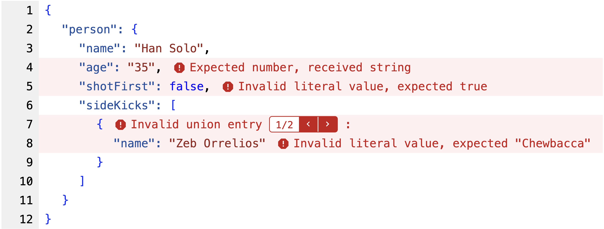

<p align="center">
  
  <h1 align="center">zod-error-viewer</h1>
<p align="center">
<a href="https://github.com/benlorantfy/zod-error-viewer/actions?query=branch%3Amain"></a>
<a href="https://twitter.com/benlorantfy" rel="nofollow"></a>
<a href="https://opensource.org/licenses/MIT" rel="nofollow"></a>
</p>
  <p align="center">
    Quickly visualize and understand even the meanest zod errors ✔️
  </p>
</p>
<br/>



## Motivation

Zod is an amazing library. However, hairy zod errors can take a while to understand. The goal of `zod-error-viewer` is to drastically cut down on the time it takes to read and understand even the most complex zod errors.

## Getting Started

### Installing

```
npm install zod-error-viewer
```

### Basic Example

```tsx
import { ZodErrorViewer } from "zod-error-viewer";

<ZodErrorViewer
  data={/* data that was validated */}
  error={/* ZodError that occurred */}
/>;
```

### Documentation

For more examples and documentation, see:
